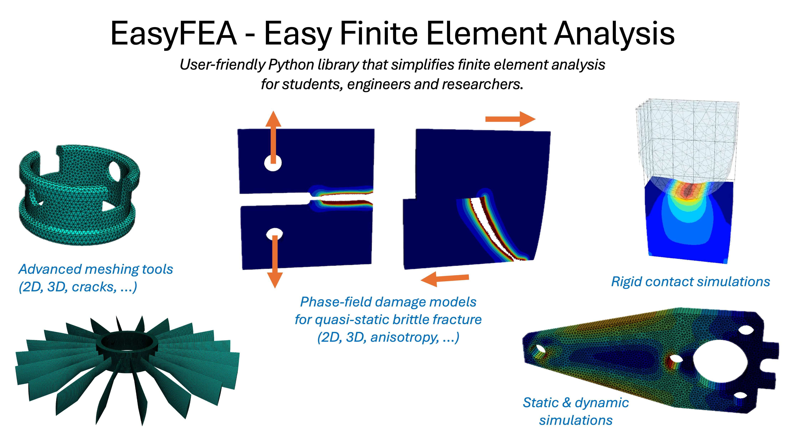

.. include:: links.rst

EasyFEA documentation
=====================

🧭 Overview
-----------

**EasyFEA** is a user-friendly Python library that simplifies finite element analysis. It is flexible and supports different types of simulations without requiring users to handle complex PDE formulations. You will find below the finite element analysis that you can conduct using EasyFEA:

1. :doc:`Linear elastic simulations <examples/LinearizedElasticity/index>`: ``static``, ``dynamic``, ``contact``, ``homogenization`` and ``mesh optimization``.
2. :doc:`Hyperelastic simulations <examples/Hyperelasticity/index>`: ``static`` and ``dynamic`` in the ``Lagrangian`` framework.
3. :doc:`Euler-Bernoulli beam simulations <examples/Beam/index>`: ``static``.
4. :doc:`Thermal simulations <examples/Thermal/index>`: ``static`` and ``dynamic``.
5. :doc:`Phase-field damage simulations for quasi-static brittle fracture <examples/PhaseField/index>`: advanced ``2D`` and ``3D`` simulations for ``isotropic``, ``transversely isotropic``, and ``anisotropic`` materials.
6. :doc:`Weak forms simulations <examples/WeakForms/index>`: ``static`` and ``dynamic`` for ``linear`` or ``non-linear`` problems.
7. `Digital Image Correlation DIC and Parameter identification <https://gitlab.univ-eiffel.fr/collaboration-msme-fcba/spruce-params>`_.
8. `Stochastic phase-field simulations <https://gitlab.univ-eiffel.fr/collaboration-msme-fcba/spruce-stochastic>`_.

For each simulation, users create a :py:class:`~EasyFEA.fem.Mesh` and a :py:class:`~EasyFEA.models._IModel`. Once the simulation has been set up, defining the boundary conditions, solving the problem and visualizing the results is straightforward.

Numerous examples of mesh creation are available in the  :doc:`/examples/Meshes <examples/Meshes/index>` gallery.

The simplest and quickest introduction is available in the :ref:`begin`.

⚖️ License
----------

Copyright (C) 2021-2025 Université Gustave Eiffel.

EasyFEA is distributed under the terms of the `GNU General Public License v3.0 only <GNU_>`_, see `LICENSE.txt <LICENSE_>`_ and `CREDITS.md <CREDITS_>`_ for more information.

💻 Installation
---------------

EasyFEA can be easily installed from `PyPI`_ using pip, compatible with Python versions 3.9 through 3.13:

.. image:: https://img.shields.io/pypi/v/easyfea.svg
   :target: https://pypi.org/project/easyfea/
   :alt: Version PyPI

.. image:: https://img.shields.io/pypi/pyversions/easyfea
   :target: https://pypi.org/project/easyfea/
   :alt: Versions Python

.. code-block:: console

   pip install EasyFEA

You can also install EasyFEA with the `source code <GitHub_>`_ using the ``pip install .`` command in the downloaded or cloned EasyFEA *folder*.

📦 Dependencies
^^^^^^^^^^^^^^^

EasyFEA uses several libraries, such as NumPy and Gmsh - as such, the following projects are required dependencies of EasyFEA:

+ `numpy <https://pypi.org/project/numpy/>`_ - Fundamental package for scientific computing with Python.
+ `gmsh <https://pypi.org/project/gmsh/>`_ (>= 4.12) - Three-dimensional finite element mesh generator.
+ `scipy <https://pypi.org/project/scipy/>`_ - Fundamental package for scientific computing in Python.
+ `matplotlib <https://pypi.org/project/matplotlib/>`_ - Plotting package.
+ `pyvista <https://pypi.org/project/pyvista/>`_ - Plotting package.
+ `numba <https://pypi.org/project/numba/>`_ - Compiling Python code using LLVM.
+ `pandas <https://pypi.org/project/pandas/>`_ (3.9 <= Python <= 3.12) - Powerful data structures for data analysis.
+ `imageio <https://pypi.org/project/imageio/>`_ and `imageio[ffmpeg] <https://pypi.org/project/imageio-ffmpeg/>`_ - Library for reading and writing a wide range of image, video, scientific, and volumetric data formats.
+ `meshio <https://github.com/matnoel/meshio/tree/medit_higher_order_elements>`_ - I/O for many mesh formats.

🧪 Optional Dependencies
^^^^^^^^^^^^^^^^^^^^^^^^

EasyFEA includes a few optional dependencies for reducing resolution time or for performing DIC:

+ `pypardiso <https://pypi.org/project/pypardiso/>`_ (Python > 3.8 & Intel oneAPI)  - Library for solving large systems of sparse linear equations.
+ `petsc <https://pypi.org/project/petsc/>`_ and `petsc4py <https://pypi.org/project/petsc4py/>`_ - Python bindings for PETSc.
+ `opencv-python <https://pypi.org/project/opencv-python/>`_ - Computer Vision package.

🔤 Naming conventions
---------------------

**EasyFEA** uses Object-Oriented Programming (`OOP <https://en.wikipedia.org/wiki/Object-oriented_programming>`_) with the following naming conventions:

+ ``PascalCasing`` for classes
+ ``camelCasing`` for properties
+ ``Snake_Casing`` or ``Snake_casing`` for functions/methods

In this library, objects can contain both **public** and **private** properties or functions.

**Private** parameters or functions are designated by a double underscore, such as ``__privateParam``. In addition, parameters or functions beginning with an underscore, such as ``_My_Function`` are accessible to advanced users, but should be used with caution.

✍ Citing EasyFEA
----------------

If you are using EasyFEA as part of your scientific research, please contribute to the scientific visibility of the project by citing it as follows.

    Noel M., *EasyFEA: a user-friendly Python library that simplifies finite element analysis*, https://hal.science/hal-04571962

Bibtex:

.. code-block::

    @softwareversion{
        noel:hal-04571962v1,
        TITLE = {{EasyFEA: a user-friendly Python library that simplifies finite element analysis}},
        AUTHOR = {Noel, Matthieu},
        URL = {https://hal.science/hal-04571962},
        NOTE = {},
        INSTITUTION = {{Universit{\'e} Gustave Eiffel}},
        YEAR = {2024},
        MONTH = Apr,
        SWHID = {swh:1:dir:ffb0e56fe2ce8a344ed27df7baf8f5f1b58700b5;origin=https://github.com/matnoel/EasyFEA;visit=swh:1:snp:88527adbdb363d97ebaee858943a02d98fc5c23c;anchor=swh:1:rev:ee2a09258bfd7fd60886ad9334b0893f4989cf35},
        REPOSITORY = {https://github.com/matnoel/EasyFEA},
        LICENSE = {GNU General Public License v3.0},
        KEYWORDS = {Finite element analyses ; Computational Mechanics ; Numerical Simulation ; Phase field modeling of brittle fracture ; Linear elasticity ; Euler-Bernoulli beam ; DIC - Digital Image Correlation ; User friendly ; Object oriented programming ; Mesh Generation},
        HAL_ID = {hal-04571962},
        HAL_VERSION = {v1},
    }

📘 Projects and Publications
----------------------------

📝 Scientific Publications
^^^^^^^^^^^^^^^^^^^^^^^^^^

- Noel M. et al.,  *Parameter identification for phase-field modeling of brittle fracture in spruce wood* - Engineering Fracture Mechanics, https://doi.org/10.1016/j.engfracmech.2025.111304

🧪 Research Projects
^^^^^^^^^^^^^^^^^^^^

- `Material parameters of a phase-field model used to simulate brittle fracture of spruce specimens. <SpruceParams_>`_
- `Stochastic phase-field modeling of spruce wood specimens under compression. <SpruceStochastic_>`_

🤝 Contributing
---------------

**EasyFEA** is an emerging project with a strong commitment to growth and improvement. Your input and ideas are invaluable to me. I welcome your comments and advice with open arms, encouraging a culture of respect and kindness in our collaborative journey towards improvement.

To learn more about contributing to EasyFEA, please consult the `Contributing Guide <https://github.com/matnoel/EasyFEA/blob/main/CONTRIBUTING.md>`_.

Contents
--------

.. toctree::
    :maxdepth: 1

    begin
    examples/index
    api/index

Indices and tables
------------------

* :ref:`genindex`
* :ref:`modindex`
* :ref:`search`